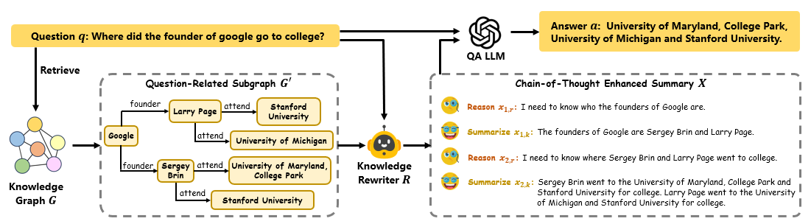

# CoTKR: Chain-of-Thought Enhanced Knowledge Rewriting for Complex Question Answering

> **Abstract**
Recent studies have explored the use of Large Language Models (LLMs) with Retrieval Augmented Generation (RAG) for Knowledge Graph Question Answering (KGQA). They typically require rewriting retrieved subgraphs into natural language formats comprehensible to LLMs. However, when tackling complex questions, the knowledge rewritten by existing methods may include irrelevant information, omit crucial details, or fail to align with the question's semantics. To address them, we propose a novel rewriting method CoTKR, **C**hain-**o**f-**T**hought Enhanced **K**nowledge **R**ewriting, for generating reasoning traces and corresponding knowledge in an interleaved manner, thereby mitigating the limitations of single-step knowledge rewriting. Additionally, to bridge the preference gap between the knowledge rewriter and the question answering (QA) model, we propose a training strategy PAQAF, **P**reference **A**lignment from **Q**uestion **A**nswering **F**eedback, for leveraging feedback from the QA model to further optimize the knowledge rewriter. We conduct experiments using various LLMs across several KGQA benchmarks. Experimental results demonstrate that, compared with previous knowledge rewriting methods, CoTKR generates the most beneficial knowledge representation for QA models, which significantly improves the performance of LLMs in KGQA.
> 

This is the accompanying code for the paper **CoTKR: Chain-of-Thought Enhanced Knowledge Rewriting for Complex Question Answering**.  
The paper has been accepted by the The 2024 Conference on Empirical Methods in Natural Language Processing (EMNLP 2024).

## Setup
### Environment Setup
```
conda create -n CoTKR python=3.12
conda activate CoTKR
pip install -r requirement1.txt
conda create -n tune python=3.12
conda activate tune
pip install -r requirement2.txt
```
**Note: Due to the impact of different versions of PEFT on training and inference, we utilize two versions of environment. Please use the tune environment for model training, and the CoTKR environment in other cases.**
### Freebase Setup
Please setup Freebase following the instructions in [Freebase-Setup](https://github.com/dki-lab/Freebase-Setup).
### LLM Setup
We employ various LLMs as the backbone, including [Llama-2-7b-chat-hf](https://huggingface.co/meta-llama/Llama-2-7b-chat-hf), [Meta-Llama-3-8B-Instruct](https://huggingface.co/meta-llama/Meta-Llama-3-8B-Instruct), [Mistral-7B-Instruct-v0.3](https://huggingface.co/mistralai/Mistral-7B-Instruct-v0.3). Download LLMs to ```pretrain/```.
```
CoTKR/
pretrain/
    ├── Llama-2-7b-chat-hf/
    ├── Meta-Llama-3-8B-Instruct/
    └── Mistral-7B-Instruct-v0.3/                       
```
### Dataset Setup
We evaluate our method on two datasets, [GrailQA](https://dki-lab.github.io/GrailQA/), [GraphQuestions](https://github.com/dki-lab/GrailQA/tree/main/data). Download GrailQA to ```CoTKR/subgraph/grailqa/data```. Rename ```grailqa_v1.0_train.json``` to ```train.json``` and ```grailqa_v1.0_dev.json``` to ```test.json```. Download GraphQuestions to ```CoTKR/subgraph/GraphQuestions/data```. Rename ```graphquestions_v1_fb15_training_091420.json``` to ```train.json``` and ```graphquestions_v1_fb15_test_091420.json``` to ```test.json```.
```
CoTKR/
└── subgraph/
    ├── grailqa/
        ├── data/
            ├── train.json
            └── test.json
    ├── GraphQuestions/
        ├── data/
            ├── train.json
            └── test.json                                     
```

## Retrieve
### Ground Truth Subgraph
Go to ```CoTKR/subgraph/grailqa/``` and run ```graph_query.py``` to get ground truth subgraph and noisy subgraph for grailqa. Go to ```CoTKR/subgraph/GraphQuestions/``` and run ```graph_query.py``` to get ground truth subgraph and noisy subgraph for GraphQuestions. You need to modify the SPARQL endpoint.
Go to ```CoTKR/subgraph/``` and run ```gold_graph.py``` to get the ground truth subgraph and relevant information for inference.

### BM25
We follow [DecAF](https://github.com/awslabs/decode-answer-logical-form) to process Freebase for BM25. Please first download [Freebase data](https://drive.google.com/file/d/13y_mwHI3pyARqIfjMxyU17U-aC0eQKHB/view?usp=share_link) and put it under ```CoTKR/inference/open/Freebase```. Run ```process_freebase.py``` to process Freebase.
Go to ```CoTKR/inference/open/retrieve/bm25/```. Run ```build_index_sparse.sh``` to build index. Run ```run_search_sparse.sh``` to query relevant documents. Run ```format.py``` to retain top 30 triples for inference.

### 2-Hop
Go to ```CoTKR/inference/open/retrieve/2hop/```. Run ```2hop.py``` to get 2-hop subgraph for each question. Run ```format.py``` to retain top 30 triples for inference. You need to modify the SPARQL endpoint.

## Corpus Generation
**We provide our constructed corpus in [CoTKR-data.zip](https://mega.nz/file/0cA2TZwQ#2oBVW0wILPdZf9IxbQCIlMMjZE3fpi0dqinqAhRuwtc). You can download it directly and escape the following corpus construction steps.**
```
CoTKR-data/
├── grailqa/
    ├── finetune/
        ├── CoT/: CoTKR finetune dataset
        ├── kg-to-text/: kg-to-text finetune dataset
        └── summary/: summary finetune dataset
    ├── PA-chatgpt/: Preference Allignment Training Corpus for ChatGPT
        └── CoT/:
            ├── llama-2-7b-chat-hf/: CoTKR Preference Allignment Training Corpus for llama-2-7b-chat-hf
            └── Meta-Llama-3-8B-Instruct/: CoTKR Preference Allignment Training Corpus for Meta-Llama-3-8B-Instruct
    ├── PA-Mistral/: Preference Allignment Training Corpus for Mistral
        └── CoT/:
            ├── llama-2-7b-chat-hf/: CoTKR Preference Allignment Training Corpus for llama-2-7b-chat-hf
            └── Meta-Llama-3-8B-Instruct/: CoTKR Preference Allignment Training Corpus for Meta-Llama-3-8B-Instruct 
└── grailqa/
    ├── finetune/
        ├── CoT/: CoTKR finetune dataset
        ├── kg-to-text/: kg-to-text finetune dataset
        └── summary/: summary finetune dataset
    ├── PA-chatgpt/: Preference Allignment Training Corpus for ChatGPT
        └── CoT/:
            ├── llama-2-7b-chat-hf/: CoTKR Preference Allignment Training Corpus for llama-2-7b-chat-hf
            └── Meta-Llama-3-8B-Instruct/: CoTKR Preference Allignment Training Corpus for Meta-Llama-3-8B-Instruct
    ├── PA-chatgpt-ablation/: Preference Allignment Training Corpus for ChatGPT in Ablation Study
        └── CoT/:
            ├── llama-2-7b-chat-hf/: CoTKR Preference Allignment Training Corpus for llama-2-7b-chat-hf
            └── Meta-Llama-3-8B-Instruct/: CoTKR Preference Allignment Training Corpus for Meta-Llama-3-8B-Instruct
    ├── PA-Mistral/: Preference Allignment Training Corpus for Mistral
        └── CoT/:
            ├── llama-2-7b-chat-hf/: CoTKR Preference Allignment Training Corpus for llama-2-7b-chat-hf
            └── Meta-Llama-3-8B-Instruct/: CoTKR Preference Allignment Training Corpus for Meta-Llama-3-8B-Instruct
    └── PA-chatgpt-ablation/: Preference Allignment Training Corpus for Mistral in Ablation Study
        └── CoT/:
            ├── llama-2-7b-chat-hf/: CoTKR Preference Allignment Training Corpus for llama-2-7b-chat-hf
            └── Meta-Llama-3-8B-Instruct/: CoTKR Preference Allignment Training Corpus for Meta-Llama-3-8B-Instruct                                   
```
If you want to generate your corpus, please follow these steps and be ready to spend a lot of money ;)
### Supervised Fine-tuning Corpus Generation
Go to ```CoTKR/corpus/```. Run ```kg-to-text.py``` to generate KG-to-Text corpus for supervised fine-tuning. Run ```summary.py``` to generate Summary corpus for supervised fine-tuning. Run ```cot.py``` to generate CoTKR corpus for supervised fine-tuning.
### Preference Alignment Corpus Generation
Go to ```CoTKR/corpus/```. Run ```pa_construct_chatgpt.py``` to generate DPO corpus for chatgpt. Run ```pa_construct_mistral.py``` to generate DPO corpus for mistral. You can also run ```pa_filter.py``` to filter some training data with low quality (optional).
### Preference Alignment Ablation Experiment Corpus Generation
Go to ```CoTKR/corpus/```. Run ```pa_ablation.py``` to construct DPO corpus without data augmentation for ablation experiment.

## Instruction Tuning
### Supervised Fine-tuning
Go to ```CoTKR/instruction-tuning/```. Run ```run_llama-7b.sh``` for fine-tuning Llama-2-7b-chat-hf. Run ```run_llama-8b.sh``` for fine-tuning Meta-Llama-3-8B-Instruct.
### Direct Preference Optimization
Go to ```CoTKR/instruction-tuning/```. First, run ```merge.py``` to merge LoRA weight with the original model. Then run ```run_dpo.sh``` for DPO, which saves a checkpoint at the end of each epoch. Run ```run_dpo-step.sh``` for DPO, which saves a checkpoint after a predefined number of steps.

## Rewrite
### Open Setting (BM25/2Hop)
Go to ```CoTKR/inference/open/rewrite/```. Run ```infer_text.py``` for KG-to-Text method. Run ```infer_summary.py``` for Summary method. Run ```infer_chain.py``` for CoTKR method. Run ```infer_pa.py``` for CoTKR+PA method. You need to modify some key parameters, like DATA, LLM, MODE.

### Closed Setting
Go to ```CoTKR/inference/closed/rewrite/```. Run ```infer_text.py``` for KG-to-Text method. Run ```infer_summary.py``` for Summary method. Run ```infer_chain.py``` for CoTKR method. Run ```infer_pa.py``` for CoTKR+PA method. You need to modify some key parameters, like DATA, LLM.

## Answer
### Open Setting (BM25/2Hop)
Go to ```CoTKR/inference/open/answer/```. Run ```answer.py``` for question-answering. You need to modify some key parameters, like DATA, LLM, ANS, MODE, KR.

### Closed Setting (Ground Truth Subgraph)
Go to ```CoTKR/inference/closed/answer/```. Run ```answer.py``` for question-answering. You need to modify some key parameters, like DATA, LLM, ANS, KR.

### No Knowledge
Go to ```CoTKR/inference/open/answer/```. Run ```answer_no.py``` for question-answering without contextual knowledge. You need to modify some key parameters, like DATA, ANS.

